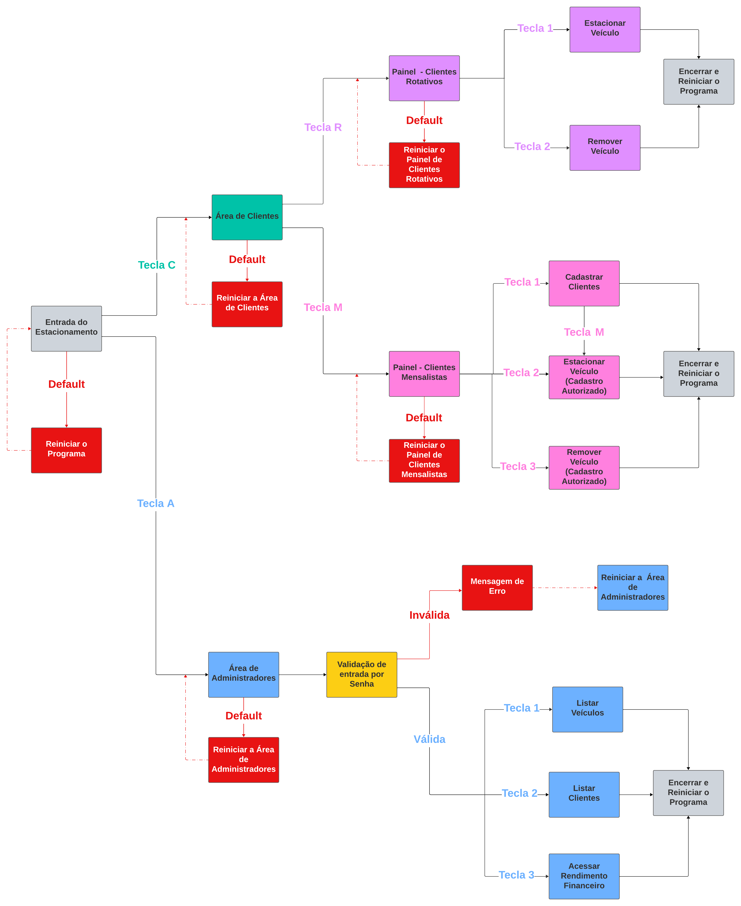

# DIO - Trilha .NET - Fundamentos
www.dio.me

## Desafio de projeto
Criar um sistema de estacionamento privado a partir dos conhecimentos sobre **Programação Orientada a Obejtos (POO)** vistos no **Bootcamp Decola Tech 2024 - Avanade**. 

**Feito por: Whendel Muniz dos Santos**

## Proposta projetada pelo estudante
O modelo de estacionammento foi incrementado com 2 modalidades:

**1. Área do Cliente:** Área aberta para todos os clientes que venham a se interessar no estacionamento. Neste projeto, há dois modelos:

   **1.1 Estacionamento Rotativo:** Modelo baseado em estacionar veículos durante até 1 dia e o valor é pago na saída (retirada do veículo após o tempo de estacionamento).
         Neste método, apesar de não haver cadastro obrigatório, são solicitados o nome e o CPF do usuário que estacionar o veículo. 
         
   **1.1.1 Opções no Modo Rotativo:**
           
-   **Estacionar Veículos**
  - **Remover Veículos**

         
**1.2 Estacionamento Mensalista:** Modelo baseado em estacionar veículos durante, pelo menos, 1 mês com valor pago na entrada (é feito um cadastro e um plano de estacionamento previamente com pagamento imediato).
        Neste método, para acessar o Modo Mnesalista, é necessário, obrigatoriamente, estar cadastrado previamente no sistema, sendo solicitados o nome e o CPF do usuário que 
        estacionar o veículo.  

        
**1.2.1 Opções no Modo Mensalista:**
  -  **Cadastrar Clientes**
  -  **Estacionar Veículos**
-  **Remover Veículos**     
  
**2. Área do Administrador**: Área fechada e com entrada liberada apenas para funcionários ou colaboradores que possuam uma senha específica disponibilizada pela empresa. É uma área privativa com informações confindenciais e utilizada como banco de dados para a segurança dos usuários e da empresa, além de auxiliar na elaboração de relatórios financeiros.       

**2.1 Opções da Área do Administrador**
  
   -  **Listar Veículos**
  -  **Listar Clientes**
-  **Acesssr Rendimento Financeiro**    

## Diagrama de Funcionamento do Sistema

## Exemplos de Apresentação do Projeto
- **1. Mensagem Inicial e Modo Rotativo**
https://github.com/WhendelM/trilha-net-fundamentos-desafio/assets/142748618/1958a569-9638-435d-a289-4a7f240e54d1

É possível visualizar que a função de estacionar veículos duas vezes com um aviso do número de vagas disponíveis naquele momento, além da função de remover veículos e um aviso de erro ao remover um veículo de placa desconhecida pelo sistema. Também, é possível observar que o sistema consegue identificar as respostas das opções em letras minúsculas, pois está programado para convetê-las para minúsculas.

- **2.Modo Mensalista**
  

https://github.com/WhendelM/trilha-net-fundamentos-desafio/assets/142748618/dd72b5e5-0390-4ec7-8f62-b4df73be8b6a

É possível visualizar a função de cadastrar clientes interligada com a função de estacionar veículos. Também, é possível visualizar que o pagamento é feito na "entrada" do estacionamento ao estacionar e que o estacionamento/remoção do veículo só é liberado se o nome do cliente estiver cadastrado no sistema.

-  **3. Estacionamento Lotado** 

https://github.com/WhendelM/trilha-net-fundamentos-desafio/assets/142748618/5a79796b-fe85-4006-a8e6-a1e0177f5193

É possível visualizar que, quando não há mais vagas no estacionamento, o cliente não consegue estacionar nenhum carro e recebe uma mensagem de aviso do sistema.

-  **4. Modo Administrador**
https://github.com/WhendelM/trilha-net-fundamentos-desafio/assets/142748618/16d2559e-d950-48a6-af72-4c81df9b51e6

É possível analisar 3 funções: Listar Veículos (apenas veículos estacionados atualmente), Listar Clientes (com todos os clientes que estacionaram o veículo em algum momento, mesmo os veículos já removidos) separados por modalidade, além do rendimento de cada modalidade junto com o total. O acesso à Área de Administradores só é aceito para colaboradores que possuem o padrão de senha programado no sistema (LETRA LETRA LETRA NÚMERO), ou seja, caso o padrão não seja esse, o acesso é negado. 

- **5. Defaults Comuns**

https://github.com/WhendelM/trilha-net-fundamentos-desafio/assets/142748618/55ee9bc8-c042-4cc5-9b38-b6d31b6ff92f

O sistema também foi programado para que o cliente, caso acione alguma tecla inesperada, volte para a tela anterior ao erro. 

## Metodologia de Código 

**1. Varíavies**:
- **1.1 Modo Rotativo**

       namespace DesafioFundamentos.Models
      {

      public class Estacionamento
      {
        //Objetos para o modo ROTATIVO de estacionamento (rot). 
        //Em ordem: Preço Inicial Fixo, Preço por Hora e Lista com os Veículos (Placas).
        private const decimal PrecoInicialRot = 10;
        private const decimal PrecoAdicionalRot = 3;
        public static List<string> veiculosRot = new List<string>();

- **1.2 Modo Mensalista**

        
        //Objetos para o modo ROTATIVO de estacionamento (rot).
        //Em ordem: Preço Inicial Fixo, Preço por Hora e Lista com os Veículos (Placas).
        private const decimal PrecoInicialRot = 10;
        private const decimal PrecoAdicionalRot = 3;
        public static List<string> veiculosRot = new List<string>();

- **1.3 Administrador**

        //Objetos para o controle do Administrador.
        //Em ordem: Listas com os veículos diários,com os nomes, os cpfs, o rendimento de cada parte do estacionamento (Rotativo e Mensalista) e o limite máximo dos veículos das duas partes. 
        private static List<string> veiculosRotAdm = new List<string>();
        private static List<string> NomesRotAdm = new List<string>();
        private static List<string> CpfRotAdm = new List<string>();
        private static List<decimal> RendimentoRot = new List<decimal>();
        private static List<string> veiculosMesAdm = new List<string>();
        private static List<string> NomesMesAdm = new List<string>();
        private static List<string> CpfMesAdm = new List<string>();
        private static List<decimal> RendimentoMes = new List<decimal>();
        private const int LimiteMaximo = 3; 

**2. Funções**:
- **2.1 Adicionar Veículo**: Método responsável por, a partir da resposta do usuário (cliente), direcioná-lo para a área escolhida( rotativo ou mensalista), adicionar o veículo a partir da placa entregue ao sistema e armazenar os dados do usuário para visualização do administrador. Ná área Rotativa, ao estacionar o carro, não é feito o pagamento, apenas na retiraada; já na área Mensalista, o pagamento é feito na entrada. Nessa função, também é possível controlar a quantidade de veículos em cada área do estacionamento, ou seja, se o estacionamento estiver lotado, o usuário não cnnsegue estacionar o veículo. 

        //Função de Estacionar Veículos.
        public void AdicionarVeiculo(String letra)
        {
            letra = letra.ToUpper();
            //Opção Rotativo.
            if(letra == "R"){
                //Verificar se o estacionamento rotativo está lotado.
                if(veiculosRot.Count == LimiteMaximo){
                    Console.WriteLine("O estacionamento está lotado.");
                    Console.WriteLine("Por gentileza, procure outro estabelecimento ou espere por uma vaga.");
                }
                else{
                    //Função de Estacionar implementada.
                    Console.WriteLine($"Seja bem vindo ao sistema de Estacionamento Rotativo!\n Atualmente, há {Estacionamento.LimiteMaximo - Estacionamento.veiculosRot.Count} vagas disponíveis. ");
                    Console.WriteLine("A tarifa é de R$ 10,00 e o preço adicional por hora é de R$ 3,00.");
                    Console.WriteLine("Digite o seu nome e sobrenome para continuar: ");

                    //Armazenamento de Nome e CPF para visualização do Administrador do sistema.
                    NomesRotAdm.Add(Console.ReadLine());
                    Console.WriteLine("Agora, digite o seu CPF para continuar: ");
                    CpfRotAdm.Add(Console.ReadLine());
                    Console.WriteLine("Informe a placa do seu veículo: ");
                    string placaRot = Console.ReadLine();

                    //Armazenamento do veículo no estacionamento rotativo e no ambiente do Administrador do sistema.
                    veiculosRot.Add(placaRot);
                    veiculosRotAdm.Add(placaRot);
                    placaRot = placaRot.ToUpper();
                    Console.WriteLine("O seu carro foi estacionado! Agradecemos a preferência.");
                }

            }

            //Opção Mensalista.
            else{
                //Verificar se o estacionamento mensalista está lotado.
                if(veiculosMes.Count == LimiteMaximo){
                        Console.WriteLine("O estacionamento está lotado. Por gentileza, procure outro estabelecimento ou espere por uma vaga. ");
                }
                else{
                    //Função de Estacionar implementada.
                    Console.WriteLine($"Seja bem vindo ao sistema de Estacionamento Mensalista!\n Atualmente, há {Estacionamento.LimiteMaximo - Estacionamento.veiculosMes.Count} vagas disponíveis. ");
                    Console.WriteLine("A tarifa é de R$ 250,00 e o preço adicional por mês é de R$ 50,00.");
                    Console.WriteLine("Digite seu nome e sobrenome para verificação: ");
                    string verificacao = Console.ReadLine();

                    //Verificar se o usuário já está cadastrado no sistema de estacionamento mensalista.
                        if (CadastroNomeMes.Any(x => x == verificacao)){
                            //Armazenamento de Nome e CPF para visualização do Administrador do sistema.
                            NomesMesAdm.Add(verificacao);
                            Console.WriteLine("Digite o seu CPF: ");
                            CpfMesAdm.Add(Console.ReadLine());
                            Console.WriteLine("Digite a placa do seu veículo: ");

                            //Armazenamento do veículo no estacionamento mensalista e no ambiente do Administrador do sistema. 
                            string placaMes = Console.ReadLine();
                            placaMes = placaMes.ToUpper();
                            veiculosMes.Add(placaMes);
                            veiculosMesAdm.Add(placaMes);

                            //Cálculo do valor total para o usuário pagar por uma vaga no estacionamento mensalista (o pagamento é feito  ANTES da ENTRADA do estacionamento).
                            Console.WriteLine("Digite a quantidade de meses que o veículo permanecerá estacionado:");
                            int Mes = Convert.ToInt32(Console.ReadLine());
                            decimal valorTotalMes = PrecoInicialMes + (PrecoAdicionalMes* Mes);

                            //O valor é armazenado no Rendimento total do estacionamento mensalista.
                            RendimentoMes.Add(valorTotalMes);
                            Console.WriteLine($"O seu carro foi estacionado e o preço total foi de: R$ {valorTotalMes}. Agradecemos a preferência!");
                        }
                        else{
                            Console.WriteLine("Seu nome não está cadastrado no sistema de Estacionamento Mensalista.");
                            Console.WriteLine("Por gentileza, faça o cadastro antes para aproveitar essa opção.");
                        }
                }
            }
        }

- **2.2 Cadastrar Clientes**: Função responsável por cadastrar clientes **mrnsalistas** para que possam usufruir das funcionalidades da área no estacionamento. O usuário, após o cadastro, pode ser redirecionado para estacionar o veículo, caso queira.

        //Função de Cadastrar Clientes Mensalistas.
        //Diferentemente do cliente rotativo, o cliente mensalista faz parte de um plano mais rebuscado, incluindo cadastro, já que passará mais tempo.
        public void CadastrarMensalista(){
            Console.WriteLine("Sistema de cadastramento para o plano mensalista de Estacionamento.");
            Console.WriteLine("Insira seu nome e sobrenone: ");

            //Cadastro do nome e do cpf do cliente mensalista.
            string nome = Console.ReadLine();
            CadastroNomeMes.Add(nome);
            Console.WriteLine("Insira seu CPF: ");
            string cpf = Console.ReadLine();
            CadastroCpfMes.Add(cpf);

            //Opção do cliente, agora cadastrado, estacionar o veículo no modo mensalista. 
            Console.WriteLine("Agradecemos o cadastro no sistema Estacionamento Mensalista.");
            Console.WriteLine("Caso queira já estacionar seu veículo no modo mensalista, é só clicar a tecla M.");
            Console.WriteLine("Caso não, é só clicar qualquer outra tecla.");
            string tecla = Console.ReadLine();
            tecla = tecla.ToUpper();

            //O cliente é direcionado para a opção de Adicionar Veículo do modo Mensalista.
            if(tecla == "M"){
                AdicionarVeiculo(tecla);
            }
        }

- **2.3 Remover Veículos**: Função responsável por remover os veículos de cada área do estacionamento. Nessa função, o pagamento do cliente rotativo é efetuado.

            //Função de Remover Veículos
            public void RemoverVeiculo(string letra){ 
            //Opção Rotativo.  
            if(letra == "R") {
                Console.WriteLine("Digite a placa do veículo para remover: ");
                string placaRot = Console.ReadLine();
                //Verificar se o veículo foi estacionado. 
                if (veiculosRot.Any(x => x.ToUpper() == placaRot.ToUpper())){
                    Console.WriteLine("Digite a quantidade de horas que o veículo permaneceu estacionado:");

                    //Retirada do Veículo e cálculo do valor total do pagamento do cliente (o pagamento é feito ANTES da SAÍDA do estacionamento)
                    int horas = Convert.ToInt32(Console.ReadLine());
                    decimal valorTotalRot = PrecoInicialRot + (PrecoAdicionalRot * horas);

                    //O valor é armazenado no Rendimento total da parte rotativa e o veículo é removido do estacionamento.
                    RendimentoRot.Add(valorTotalRot);
                    veiculosRot.Remove(placaRot);
                    Console.WriteLine($"O veículo {placaRot} foi removido e o preço total foi de: R$ {valorTotalRot}. Agradecemos a preferência!");
                }
                else{
                    Console.WriteLine("Desculpe, esse veículo não está estacionado aqui. Confira se digitou a placa corretamente");
                }
            }
            //Opção Mensalista.
            else{
                Console.WriteLine("Digite seu nome e sobrenome para verificação: ");
                string verificacao = Console.ReadLine();

                //Verificar se o usuário já está cadastrado no sistema de estacionamento mensalista.
                if (CadastroNomeMes.Any(x => x == verificacao)){
                    Console.WriteLine("Digite a placa do veículo para remover: ");
                    string placaMes = Console.ReadLine();

                   //Verificar se o veículo foi estacionado e Remoção do veículo.
                    if (veiculosMes.Any(x => x.ToUpper() == placaMes.ToUpper())){
                        veiculosRot.Remove(placaMes);
                        Console.WriteLine($"O veículo {placaMes} foi removido! Agradecemos a preferência!");
                    }
                    else{
                        Console.WriteLine("Desculpe, esse veículo não está estacionado aqui. Confira se digitou a placa corretamente!");
                    }
                } 
                else{
                    Console.WriteLine("Seu nome não está cadastrado no sistema de Estacionamento Mensalista.");
                    Console.WriteLine("Por gentileza, faça o cadastro antes para aproveitar essa opção!");
                }
            }
        }

- **2.4 Listar Veículos**: Função utilizada apenas por administradores e responsável poe listar todos os veículos de ambas as áreas.

             public void ListarVeiculos(){
            //Listar todos os veículos rotativos que foram estacionados (incluindo os que já foram removidos).
            if (veiculosRot.Any()){
                Console.WriteLine("Os veículos rotativos estacionados são:");
                for (int contador = 0; contador < veiculosRot.Count; contador++){
                    Console.WriteLine($"Veículo {contador + 1}: {veiculosRot[contador]}\n");
                }
            }
            else{
                Console.WriteLine("Não há veículos rotativos estacionados.");
            }

            //Listar todos os veículos mensalistas que foram estacionados (incluindo os que já foram removidos).
            if(veiculosMes.Any()){
                Console.WriteLine("Os veículos mensalistas estacionados são:");
                for (int contador = 0; contador < veiculosMes.Count; contador++){
                    Console.WriteLine($"Veículo {contador + 1}: {veiculosMes[contador]}\n");
                }
            }
            else{
                Console.WriteLine("Não há veículos mensalistas estacionados.");
            }    
        }

- **2.5 Listar Clientes**: Função utilizada apenas por administradores e responsável poe listar todos os clientes e seus respectivos veículos estacionados. 
 
        //Listar as informações dos clientes (apenas para Administradores).
        public void ListarClientes(){
            Console.WriteLine("Para listar o total de clientes rotativos, digite R \n Para listar o total de clientes mensalistas ativos, digite M1 \n Para listar todos os clientes mensalistas cadastrados, digite M2 ");
            string opcoes = Console.ReadLine();
            opcoes = opcoes.ToUpper();
            //Opção Rotativo (Apenas dos que estacionaram).
            if(opcoes == "R"){
                if(NomesRotAdm.Any()){
                    //Lista os nomes, os cpfs e os veículos vinculados aos clientes rotativos que estacionaram os carros e removeram no dia.
                    Console.WriteLine("Os clientes rotativos são:");
                    for (int contador = 0; contador < NomesRotAdm.Count; contador++){
                                Console.WriteLine($"Nome: {NomesRotAdm[contador]}");
                                Console.WriteLine($"CPF: {CpfRotAdm[contador]}");
                                Console.WriteLine($"Placa do Veículo: {veiculosRotAdm[contador]}\n");
                            }  
                    }
                    else{
                        Console.WriteLine("Não há clientes rotativos no momento.");
                    }
                }

            //Opção Mensalista (Apenas dos que estacionaram).
            else if(opcoes == "M1"){
                if(NomesMesAdm.Any()){
                    //Lista os nomes, os cpfs e os veículos vinculados aos clientes mensalistas que estacionaram os carros e removeram no dia.
                    Console.WriteLine("Os clientes mensalistas são:");
                        for (int contador = 0; contador < NomesMesAdm.Count; contador++){
                                    Console.WriteLine($"Nome {contador + 1}: {NomesMesAdm[contador]}");
                                    Console.WriteLine($"CPF: {CpfMesAdm[contador]}");
                                    Console.WriteLine($"Placa do Veículo: {veiculosMesAdm[contador]}");
                        }
                    }
                else{
                    Console.WriteLine("Não há clientes mensalistas no momento.");
                }
            }
                

            //Opção Mensalista (TODOS os cadastrados).
            else{
                if(CadastroNomeMes.Any()){
                    Console.WriteLine("Os clientes mensalistas cadastrados são:");
                    //Lista os nomes e os cpfs dos clientes mensalistas cadastrados 
                        for (int contador = 0; contador < CadastroNomeMes.Count; contador++){
                                Console.WriteLine($"Nome: {CadastroNomeMes[contador]}");
                                Console.WriteLine($"CPF: {CadastroCpfMes[contador]}");
                            }
                        }
                else{
                    Console.WriteLine("Não há cadastro de clientes mensalistas no momento.");
                }
            }
        }

- **2.6 Listar Clientes**: Função utilizada apenas por administradores e responsável poe disponibilizar o rendimento financeiro de cada área e, consequentemente, o renimento total do estacionamento. 
        
        //Função para mostrar o Rendimento Total do Estacionamento (Apenas para Administradores).
        public void RendimentoTotal(){
            //Rendimento Rotativo
            if(RendimentoRot.Any()){
                decimal SomaRot = RendimentoRot.Sum();
                Console.WriteLine($"O rendimento da parte do estacionamento rotativo foi de: R$ {SomaRot}.");
            }
            else{
                Console.WriteLine("Não houve rendimeto do estacionamento rotativo.");
            }

            //Rendimento Mensalista
            if(RendimentoMes.Any()){
                decimal SomaMes = RendimentoMes.Sum();
                Console.WriteLine($"O rendimento da parte do estacionamento menaalista foi de: R$ {SomaMes}.");
            }
            else{
                Console.WriteLine("Não houve rendimeto do estacionamento mensalista.");
            }
            
            //Rendimento Total
            Console.WriteLine($"O rendimento total foi de: R${RendimentoRot.Sum() + RendimentoMes.Sum()}.");
        }
       } }

## Metodologia de Código do Funcionamento do Sistema

    using System.Text.RegularExpressions;
    using DesafioFundamentos.Models;

    Console.OutputEncoding = System.Text.Encoding.UTF8;

    Estacionamento es = new Estacionamento(); //Instaciar a Classe Estacionamento.
    bool start1 = true; //String usada para permitir que o loop ocorra sempre que um usuário terminar (simulação de um sistema de demanda).
    string inicio = string.Empty; //String de input do usuário para escolha entre a area do Administrador ou a Area do Cliente).
    string opcao = string.Empty; //String de input do usuário para escolhe entre a área do Estacionamento Rotativo ou do Estacionamento Mensalista.
    while(start1){
        Console.Clear();
        ReiniciarAouC:; //Referência de retorno caso o usuário não aperte C(Cliente) ou A (Administrador).
        Console.WriteLine("Você está acessando o Estacionamento Privado do AV2024.\nSe você é ou deseja ser nosso cliente, digite C.\nSe você é nosso colaborador ou administrador do nosso programa, digite A. ");
        //Início do Programa
        inicio = Console.ReadLine();
        inicio = inicio.ToUpper();
        ReiniciarRouM:; //Referência de retorno caso o usuário não tecle R(Rotativo) ou M(Mensalista) na área do cliente.
        switch(inicio){
            //Área do Administrador escolhida.
        case "A":
            ReiniciarSenha:;//Referência de retorno caso o usuário digite a senha errada.
            string padraoSenha = @"^[A-Z]{3}\d$"; //Padrão para senha única do administrador (LETRA LETRA LETRA NÚMERO).
            Console.WriteLine("\nVocê está na área de Administrador. Por questões de segurança, digite aqui seu código exclusivo para entrada: \n \n ");
            string senha = Console.ReadLine();
            ReiniciarOpcoesDeA:; //Referência de retorno caso o usuário não digite 1,2 ou 3 (opções da Área do Administrador).
            //Comparação entre o padrão e a senha digitada.
            if(Regex.IsMatch(senha,padraoSenha)){
                //Senha aceita
                Console.WriteLine("Você estará acessando o Menu da Admnistração.");
                Console.WriteLine("Não esqueca que as informações reitradas são privativas para a segurança do Estacionamento e dos clientes. \n");
                Console.WriteLine("Menu: ");
                Console.WriteLine("Opção 1 - Acessar veículos estacionados");
                Console.WriteLine("Opção 2 - Acessar clientes");
                Console.WriteLine("Opção 3 - Acessar Rendimento Financeiro");

                switch(Console.ReadLine()){
                    case "1": 
                        es.ListarVeiculos(); //Função Listar Veicúlos instanciada.
                    break;
                    
                    case "2":
                        es.ListarClientes(); //Função Listar Clientes instanciada.
                    break;

                    case "3":
                        es.RendimentoTotal();//Função Rendimento Total instanciada.
                    break;
                    default:
                        Console.WriteLine("Opção inválida.Tente Novamente!"); 
                        goto ReiniciarOpcoesDeA;//Opção Default Referenciada (Retorno para as opções da Área do Administrador).
                }

                goto Encerrar; //Encerra o programa e Retorna para o Início.
            }
            //Senha não aceita.
            else{
                Console.WriteLine("Código incorreto. Revise e tente novamente. \n \n");
                goto ReiniciarSenha; //Opção Default Referenciada (Retorno para digitar a senha novamente).
            }
        //Área do Cliente Escolhida.
        case "C":
            Console.WriteLine("Você está na área de cliente! \n \n Para acessar o Estacionamento Rotativo, digite R. \n Para acessar o Estacionamento Mensalista, digite M \n \n ");
            opcao = Console.ReadLine();
            opcao = opcao.ToUpper();
            break;

         default:
            Console.WriteLine("Opção inválida.Tente Novamente!");
            goto ReiniciarAouC; //Opção Default Referenciada (Retorno para o Início do Programa caso não tenha teclado A ou C).
    }

    ReiniciarOpcao:; //Referência de retorno caso o usuário não digite nenhuma das opções do Menu do Estacionamento Rotativo(R) ou Mensalista(M).
    switch(opcao){
        //Opção Rotativo
        case "R": 
            Console.WriteLine("Você escolheu o Modo Rotativo! \n \n");
            Console.WriteLine("Menu: ");
            Console.WriteLine("Opção 1 - Estacionar Veículo");
            Console.WriteLine("Opção 2 - Remover Veículo");
            string opcaoRotativo = Console.ReadLine();
            switch(opcaoRotativo){
                case "1":
                    es.AdicionarVeiculo(opcao); //Função Adicionar Veículo instanciada.
                    break;
                case "2":
                    es.RemoverVeiculo(opcao); //Função Remover Veículo instanciada.
                    break;
                default: 
                    Console.WriteLine("Opção inválida.Tente Novamente!");
                goto ReiniciarOpcao;  //Opção Default Referenciada (Retorno para as opções do Rotativo caso o usuário não tenha digitado corretamente).
            }
            break;
        case "M": 
        //Opção Mensalista
            Console.WriteLine("Você escolheu o Modo Mensalista! \n \n Caso seja novo cliente, cadastre=se em nosso sistema antes na opção 'Cadastrar Meus Dados' no menu abaixo. \n \n");
            Console.WriteLine("Menu: ");
            Console.WriteLine("Opção 1 - Cadastrar Meus Dados");
            Console.WriteLine("Opção 2 - Estacionar Veículo");
            Console.WriteLine("Opção 3 - Remover Veículo");
            string opcaoMensalista = Console.ReadLine();
            switch(opcaoMensalista){
                case "1":
                    es.CadastrarMensalista(); //FunçãO Cadastrar Veículo instanciada.
                    break;
                case "2":
                    es.AdicionarVeiculo(opcao); //Função Adicionar Veículo instanciada.
                    break;
                case "3":
                    es.RemoverVeiculo(opcao); //Função Remover Veículo instanciada.
                    break;
                default: 
                    Console.WriteLine("Opção inválida.Tente Novamente!");
                    goto ReiniciarOpcao; //Opção Default Referenciada (Retorno para as opções do Mensalista caso o usuário não tenha digitado corretamente).
            }
        break;
        default: 
            Console.WriteLine("Opção inválida.Tente Novamente!");
            goto ReiniciarRouM; //Opção Default Referenciada (Retorno para a área do cliente, caso o usuário não tenha teclado R ou M).
    }
    Encerrar:; //Referencia de Retorno ao início do programa (usado no término do painel de Administrador)
    Console.WriteLine("\n \n Finalizando...\n \n ");
    Console.WriteLine("O Canal de Serviços do AV2024 está encerrado!\n \n");
    Console.WriteLine("Reiniciando...\n \n ");
    //Finalizar o Programa e Reiniciá-lo.
    }

